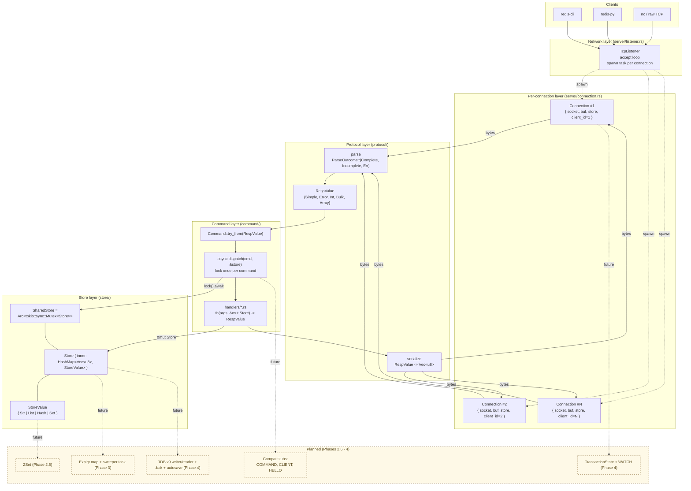
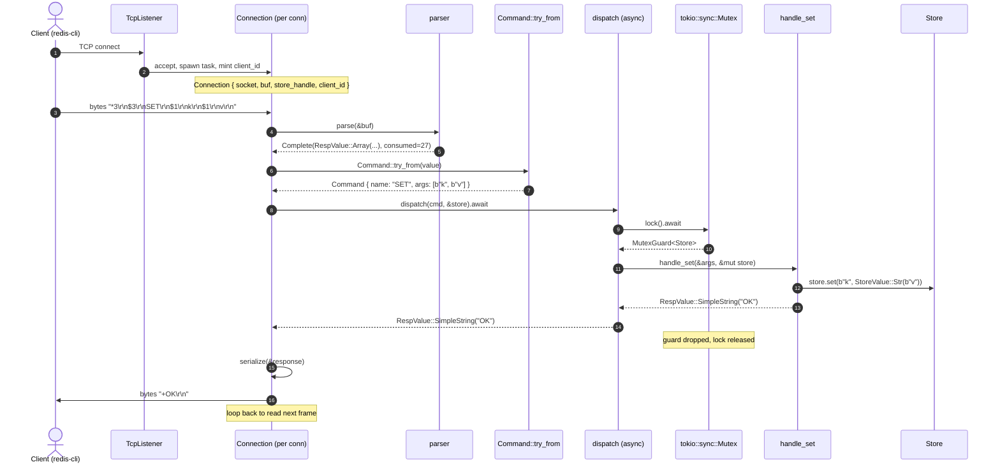
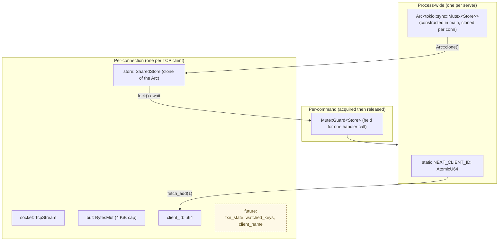

# Redis-Rust — Architecture

This document describes what's actually been built (through PR #3, "Phase 2 step 0").
The original intent lives in [`redis-rust-design.md`](./redis-rust-design.md);
deferred work is tracked in [`TODOS.md`](./TODOS.md).

## 1. Layered architecture

**Reading guide**
- Solid arrows = wired today.
- Dashed/yellow nodes = planned for upcoming PRs (per the CEO + eng review on this branch).
- The Mutex is the only shared mutable state. Everything else above the store is per-connection
  or stateless. That's deliberate — it's what makes the model easy to reason about and easy to
  evolve into transactions later.

## 2. Per-command sequence (e.g. `SET key value`)

**Things to notice**
- `PING` and `ECHO` short-circuit before the lock — keepalive traffic never contends.
- The lock is held for the duration of *one* command's handler call, then immediately dropped.
  Sequential commands on the same connection re-acquire each iteration.
- All handler work runs synchronously under the guard. No `.await` inside a handler today.
  When transactions land, `EXEC` will hold the guard across N handler calls (single critical section).

## 3. State + ownership (what lives where)

**Three lifetimes, three concerns**
- **Process-wide:** one store, one monotonic id counter. Survives forever.
- **Per-connection:** the `Connection` struct owns the socket and read buffer, holds a clone of the
  store `Arc`, and carries the connection's identity (`client_id`, soon `client_name`).
  Drops when the client disconnects.
- **Per-command:** a `MutexGuard<Store>` lives only inside `dispatch` for one command. Never escapes
  the function.

## 4. File map

| Layer | Files |
|---|---|
| Network | `src/server/listener.rs` |
| Per-conn | `src/server/connection.rs` (`Connection` struct + `handle_connection` wrapper) |
| Protocol | `src/protocol/{types,parser,serializer}.rs` |
| Command | `src/command/{types,dispatch}.rs` + `src/command/handlers/{ping,echo,set,get,del,exists,list,hash,set_cmd}.rs` |
| Store | `src/store/mod.rs` |
| Errors | `src/error.rs` |
| Entry | `src/main.rs`, `src/lib.rs` |
| Tests | `tests/phase1.rs` (integration), inline `#[cfg(test)]` modules in each handler file |
